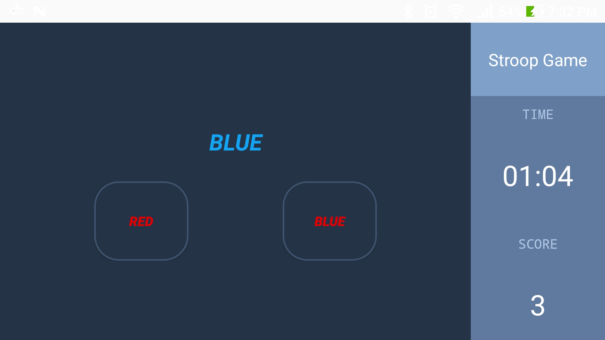
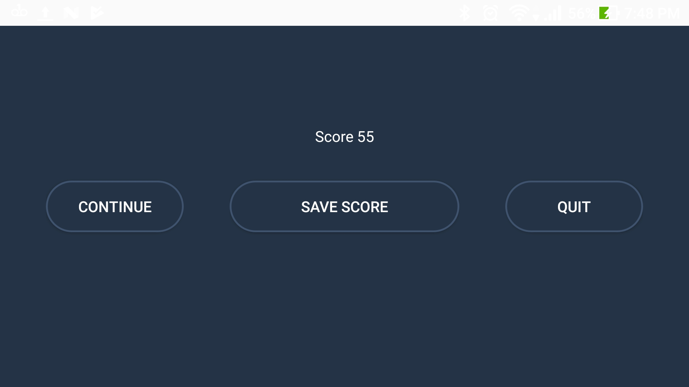

# Stroop Game

A game based on [stroop effect in psychology](https://en.wikipedia.org/wiki/Stroop_effect)

The main idea is to select the colour that describes the colour of the main text. 

 

If the main text reads "BLUE" but is in red colour then the correct selection would be the button 
that reads "RED" regardless of its colour. 

One round is capped at 1:30 minutes. At the end of game you'll be given the option to either save 
your last score and view all your scores in a graph or simply "continue" another round. You'll 
be able to also "quit"

